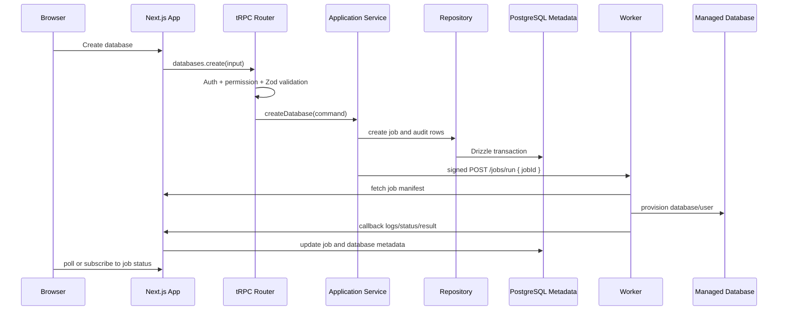

# System Architecture

## Architecture Style

Use a modular monolith plus a privileged worker.

The control plane should remain one Next.js application, not a collection of
microservices. Strong package boundaries make the codebase understandable and
leave room to split components later.

## Runtime Components

### 1. Next.js Control Plane

Location:

```text
apps/web
```

Responsibilities:

- Server-rendered dashboard pages.
- Client-side interactive tables and forms.
- tRPC route handler.
- Better Auth route handlers.
- Worker callback endpoints.
- File upload route handlers.
- Audit search UI.
- Job and worker status UI.

The control plane can read and write platform metadata through services and
repositories. It must not manage Docker or connect to managed database engines
as an administrator.

### 2. Worker

Location:

```text
apps/worker
```

Responsibilities:

- Verify signed job notifications.
- Fetch job manifests from the control plane.
- Manage Docker containers.
- Connect to managed database engines as an administrator.
- Run provisioning, backup, restore, credential, and maintenance jobs.
- Stream logs and final results back to the control plane.

The worker imports server-side packages only. It must not import React UI or
browser code.

### 3. Platform Metadata Database

PostgreSQL stores:

- Users and sessions managed by Better Auth.
- Workspace metadata.
- Workers and worker credentials.
- Managed databases and credentials metadata.
- Jobs and job logs.
- Audit logs.
- Backup configs and backup artifacts.
- Query history.
- Agent tool calls and messages.

Application access to this database uses Drizzle ORM.

### 4. Managed Database Engines

Managed engines are provisioned by workers. The first engine is PostgreSQL.

The platform metadata database and managed user databases are separate concerns.
Do not store platform metadata inside a user-managed database.

### 5. Backup Storage

Backups can be stored on:

- Local disk.
- S3-compatible object storage.
- Cloudflare R2.
- MinIO.
- Backblaze B2.

Backup metadata stays in the platform metadata database.

## Request Flow



## Layering

### UI Layer

Locations:

```text
apps/web/src/app
apps/web/src/components
apps/web/src/features/*/components
packages/ui/src
```

May import:

- React.
- tRPC client.
- UI components.
- Form schemas intended for client use.
- Type-only DTOs.

Must not import:

- `@datadock/db`.
- `@datadock/repositories`.
- `@datadock/services`.
- Drizzle ORM.
- Docker or worker internals.

### API Layer

Location:

```text
packages/api/src
apps/web/src/app/api/trpc/[trpc]/route.ts
```

Responsibilities:

- tRPC routers.
- API context.
- Procedure definitions.
- Authentication and authorization checks.
- Zod input validation.
- Output shaping.

Routers call services. Routers do not own persistence logic.

### Application Layer

Location:

```text
packages/services/src
```

Responsibilities:

- Use cases.
- Transaction orchestration.
- Cross-module workflows.
- Worker dispatch.
- Audit creation.
- Permission-sensitive commands.
- Calls to repositories and domain rules.

### Domain Layer

Location:

```text
packages/domain/src
```

Responsibilities:

- Pure rules.
- State transitions.
- Capability checks.
- Engine-independent validation.
- SQL safety classification.
- Backup policy calculations.

Domain code must be testable without a database, network, Docker, or filesystem.

### Repository Layer

Location:

```text
packages/repositories/src
```

Responsibilities:

- Drizzle queries.
- Persistence mapping.
- Transaction-scoped repository methods.
- Read model queries.

Repositories do not send email, dispatch jobs, manage Docker, or enforce UI
behavior.

### Database Layer

Location:

```text
packages/db/src
```

Responsibilities:

- Drizzle schema.
- Drizzle client.
- Migration setup.
- Transaction helper.
- Database connection lifecycle.

## Trust Boundaries

- Browser to Next.js: authenticated user session and CSRF protection where
  applicable.
- Next.js to metadata database: trusted server-side connection through Drizzle.
- Next.js to worker: signed request with timestamp and nonce.
- Worker to Next.js callbacks: bearer worker token over HTTPS.
- Worker to Docker socket: privileged local trust boundary.
- Worker to managed database engine: admin connection held by worker only.
- User database client to managed database: direct database protocol, not routed
  through the dashboard by default.
