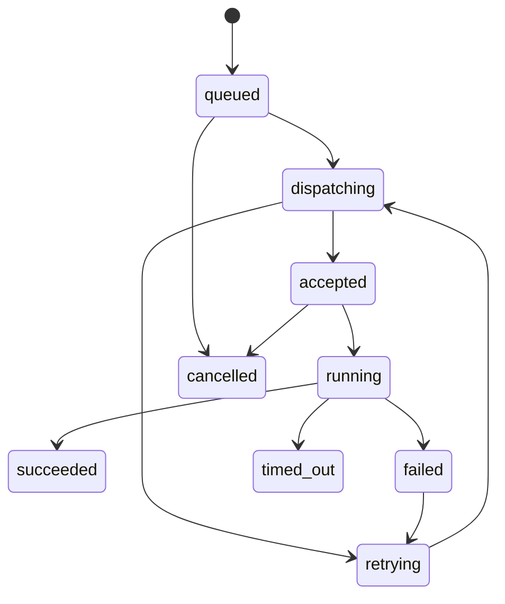

# Worker, Jobs, And Engines

## Worker Security Model

The control plane pushes a signed job notification to the worker. The request
body contains only a job ID.

```http
POST /jobs/run
content-type: application/json

{ "jobId": "job_..." }
```

The worker must:

1. Read the raw request body.
2. Verify signature headers before parsing JSON.
3. Check timestamp freshness.
4. Check nonce uniqueness.
5. Look up active worker secret.
6. Constant-time compare the expected HMAC.
7. Parse JSON only after signature verification.
8. Validate `{ jobId }` with Zod.
9. Fetch the manifest from the control plane.
10. Verify the job belongs to this worker.
11. Validate manifest input for the job type.
12. Execute only a registered job handler.

## Required Signature Headers

```text
x-datadock-worker-id
x-datadock-signature-version
x-datadock-secret-version
x-datadock-timestamp
x-datadock-nonce
x-datadock-signature
```

Canonical signature input:

```text
METHOD + "\n" +
URL_PATH + "\n" +
TIMESTAMP + "\n" +
NONCE + "\n" +
RAW_REQUEST_BODY
```

Default freshness window: 5 minutes.

Single-process workers can start with an in-memory nonce cache. Multi-process or
multi-replica workers need Redis or another atomic shared nonce store.

## Job Lifecycle



Rules:

- Dispatch failure is not job failure.
- Worker acceptance means the worker received the notification.
- Running means the worker fetched and accepted the manifest.
- Terminal states are `succeeded`, `failed`, `cancelled`, and `timed_out`.
- Job logs are append-only.
- Jobs that mutate engines should use idempotency keys or operation locks.

## Manifest Fetch

After signature verification, the worker calls:

```http
GET /api/internal/workers/jobs/:jobId/manifest
authorization: Bearer <worker-api-token>
```

The control plane verifies:

- Worker token.
- Worker status is active.
- Job exists.
- Job is assigned to this worker.
- Job can be executed.
- Job has not expired.
- Manifest hash matches stored input and policy version.

## Engine Interface

Every engine implementation should expose a capability model.

Core capabilities:

- `createDatabase`
- `deleteDatabase`
- `createCredential`
- `rotateCredential`
- `revokeCredential`
- `introspectSchema`
- `executeSql`
- `createBackup`
- `restoreBackup`
- `checkHealth`

Each capability declares:

- Whether it is supported.
- Required permission.
- Required confirmation level.
- Timeout policy.
- Lock scope.
- Audit event type.

## PostgreSQL MVP

Default provisioning model:

- One PostgreSQL engine container per worker.
- Many logical databases inside that engine.
- Separate users and credentials per managed database.

Stronger future isolation:

- One container per managed database.
- Dedicated volume per database.
- Dedicated network policy.

Do not make stronger isolation the default until the MVP lifecycle is stable.

## Locking Rules

Use locks for:

- Database create/delete.
- Credential rotation.
- Backup and restore.
- Engine container start/stop.
- Schema-changing SQL when needed.

Lock scopes:

- `worker:<workerId>`
- `engine:<engineId>`
- `database:<databaseId>`
- `backup:<backupId>`

## Worker Callback Rules

Worker callbacks must:

- Use HTTPS in production.
- Authenticate with a worker API token.
- Include job ID, worker ID, attempt ID, and request ID.
- Validate payloads with Zod.
- Be idempotent.
- Reject callbacks from revoked workers.
- Reject callbacks for jobs assigned to another worker.

Callbacks can append logs, mark progress, update resource metadata, and mark the
job terminal.
