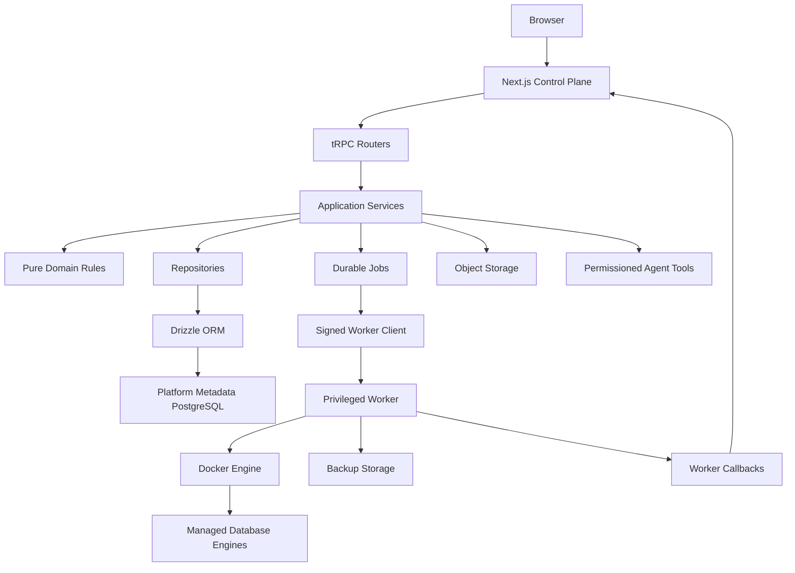

# DataDock Architecture Pack

This folder is the build blueprint for DataDock: a self-hosted database
management platform for personal labs, homelabs, small teams, and internal
developer environments.

DataDock is not a hosted database company, Kubernetes operator, or general
remote command runner. It is a small, understandable control plane that can
provision and operate developer databases through a tightly permissioned worker.

## Product Definition

DataDock has two runtime responsibilities:

- The control plane owns the dashboard, authentication, authorization, platform
  metadata, tRPC API, audit logs, and job orchestration.
- The worker owns Docker access, database engine administration, backups,
  restores, and other privileged operations.

The platform metadata database is PostgreSQL and application data access must
use Drizzle ORM through the `@datadock/db` and `@datadock/repositories`
packages. Browser and UI code never talks to Drizzle directly.

## Document Map

Read these in order:

1. [Product Requirements](./01-product-requirements.md)
2. [System Architecture](./02-system-architecture.md)
3. [Domain Boundaries](./03-domain-boundaries.md)
4. [Data Model And Drizzle ORM](./04-data-model-drizzle.md)
5. [Auth, Workspaces, And Permissions](./05-auth-workspaces-permissions.md)
6. [Worker, Jobs, And Engines](./06-worker-jobs-engines.md)
7. [tRPC And Zod API Contracts](./07-trpc-zod-api.md)
8. [Next.js UI Architecture](./08-nextjs-ui-routes.md)
9. [Backups, Files, And Agent Tools](./09-backups-files-agent.md)
10. [Production, Security, Testing, And Ops](./10-production-security-testing-ops.md)
11. [Implementation Playbook](./11-implementation-playbook.md)
12. [Final Production Readiness](./12-final-production-readiness.md)
13. [End-User Production Product Standard](./13-end-user-production-product.md)

## Non-Negotiable Architecture Rules

1. Docker access is isolated to `apps/worker`; the Next.js app never mounts or
   reaches the Docker socket.
2. Platform metadata is stored in PostgreSQL and accessed through Drizzle ORM.
3. UI components never import Drizzle, repositories, database clients, or
   application services.
4. tRPC routers validate input with Zod, check permissions, and call application
   services. They do not perform direct persistence writes.
5. Application services orchestrate use cases, transactions, domain rules,
   repositories, jobs, audit logs, and cross-module writes.
6. Domain code remains pure TypeScript. It does not import React, Next.js,
   Drizzle, storage clients, email providers, worker code, or job queues.
7. Repositories are the only normal place for Drizzle queries. They contain
   persistence logic, not product policy.
8. Every workspace-owned metadata row includes `workspaceId` unless it is a
   global auth, platform, or lookup table.
9. Destructive operations are confirmed, permission-checked, audited, and
   preferably reversible through jobs.
10. Worker requests use signed, replay-protected commands. A worker never trusts
    job manifests embedded in the incoming request body.
11. Engine drivers expose capabilities through a common interface, but each
    engine may declare unsupported features.
12. Boundaries are enforced with TypeScript package exports, dependency-cruiser,
    lint rules, tests, and CI.
13. End-user releases include install, upgrade, rollback, backup, restore,
    monitoring, alerts, support bundle, and documentation flows. The product is
    not ready just because the happy-path database UI works.

## Required Workspace Structure

```text
datadock/
  apps/
    web/                  Next.js control plane
    worker/               Privileged worker service

  packages/
    api/                  tRPC routers, API context, router contracts
    auth/                 Better Auth config, sessions, permissions
    config/               Environment validation and shared constants
    db/                   Drizzle schema, migrations, client, transactions
    domain/               Pure platform and engine rules
    email/                Email provider adapters and templates
    files/                Object storage, signed URLs, file metadata helpers
    jobs/                 Job queues, schedules, processors, dispatch helpers
    repositories/         Drizzle query and persistence repositories
    services/             Application use cases and orchestration
    ui/                   Shared UI primitives and design system

  docs/
    architecture/
```

Package names:

```text
@datadock/web
@datadock/api
@datadock/auth
@datadock/config
@datadock/db
@datadock/domain
@datadock/email
@datadock/files
@datadock/jobs
@datadock/repositories
@datadock/services
@datadock/ui
```

## High-Level Architecture



## Chosen Stack

- Framework: Next.js App Router.
- Workspace: pnpm workspaces.
- Language: TypeScript.
- API: tRPC.
- Validation: Zod.
- Auth: Better Auth.
- Platform metadata database: PostgreSQL.
- ORM: Drizzle ORM.
- Managed engine MVP: PostgreSQL through Docker.
- UI: Tailwind CSS, shadcn/ui, TanStack Table, Monaco Editor.
- Worker: Node.js service, Express or equivalent HTTP framework, dockerode.
- Jobs: durable database-backed jobs first; Redis/BullMQ can be added when
  queue throughput requires it.
- Storage: local disk and S3-compatible object storage.
- Observability: structured logs, audit logs, request IDs, worker heartbeats,
  job logs, and backup verification logs.
